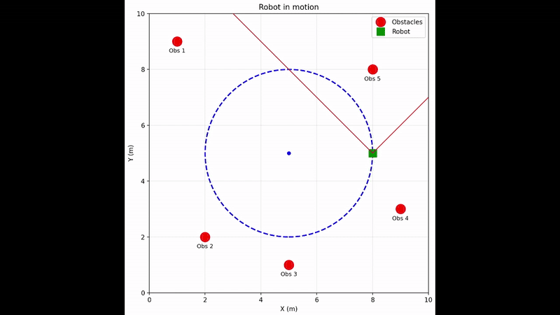

# Estimation modality

## Project Overview
This project simulates a robot moving in a circular trajectory while detecting static obstacles using a sensor. The Kalman filter is applied to improve the noisy sensor measurements and estimate the true positions of the obstacles.

  

## Files Description

### Data Files

**robot_positions.txt**
- Contains the ground truth positions (x, y) of the robot at each simulation frame
- Format: Two columns (x, y) representing robot coordinates in meters

**distances_noisy.txt**
- Contains the raw relative distances (dx, dy) from the robot to detected obstacles at each frame
- Simulates realistic sensor measurements with uncertainty
- Calculated from the sensor's field of view (90° range)
- Format: 10 columns (dx1, dy1, dx2, dy2, ..., dx5, dy5) for up to 5 simultaneous obstacle detections
- Zero values indicate no detection in that slot

**real_obstacles.txt**
- Ground truth positions of the 5 static obstacles in the environment
- Format: Two columns (x, y) representing obstacle coordinates in meters

||One lap|Three laps|
|------|:------:|:-----:|
|Total detections|152|453|
|Representation|||

## Objectives
- Understand the principle behind the Kalman filter
- Develop a sturdy Kalman filter for the guiven dataset
- Quick study case bretween 1 and 3 laps
