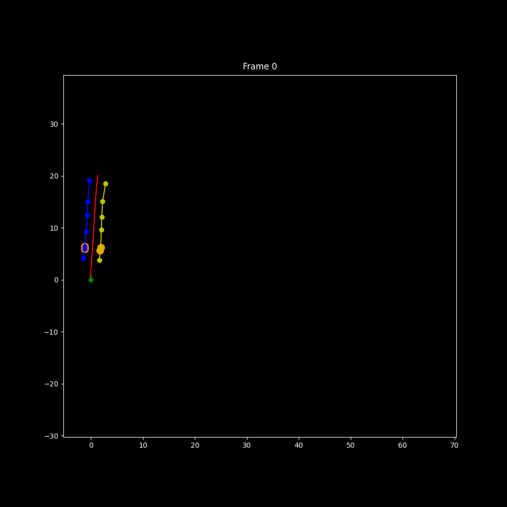

# TLSRacing Hackathon – Path Planning

**Goal:**  
Develop a simple, fast, and reliable path-planning module for a driverless Formula Student car.  
This problem represents roughly enough to challenge your logic, creativity, and efficiency.

<p align="center">
  
</p>

---

## Challenge Overview
Your task is to compute a smooth and feasible driving path from cone detections.

For the hackathon setup:
- A **baseline “dumb” planner** is provided — it only drives straight ahead.  
- Your mission is to **replace or enhance** it with a better path-planning approach.  
- Focus on **correctness and robustness first**, and optimize speed once it works.

---

## Project Structure
**Main entry points:**
- `fsd_path_planning/full_pipeline/full_pipeline.py` – high-level pipeline orchestrator.  
- `fsd_path_planning/config.py` – mission configuration and class selection.  
- `fsd_path_planning/calculate_path/dumb_calculate_path.py` – baseline straight-line path calculator.

**Run the demo:**
```bash
python -m fsd_path_planning.demo
```
## Objectives
-  Improve Computing time
-  Complexity and performance of the algorithm used
-  Viability to be driven (smooth line, stable cornering)
